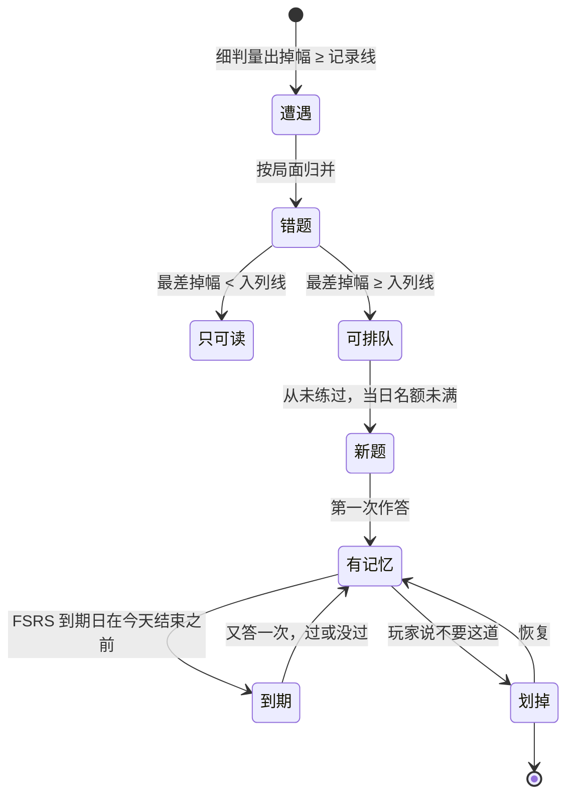

# 主干 / Mainlines

棋镜把你走错的每一步变成一道你会再走一遍的题。下面四条主干是这件事的全部路线；
名词在 [CONTEXT.md](../CONTEXT.md) 里，为什么在 [docs/adr/](./adr/) 里，这里只说**发生了什么，按什么顺序**。

每一步下面那行反引号是它在代码里的落点。核对它们：`skills/mainline/scripts/verify-anchors.sh`。

---

## 一步棋是怎么变成错题的

1. 玩家在棋盘上落子。会话先问这步该不该称：轮到人走、没在称别的、有引擎、棋局没结束。
   有一条不成立，这步棋就无判地站住。
   `Sources/ChessmirrorKit/GameSession.swift:play`
2. 该称的，这步棋**先落到棋盘上**，记录上也先摆好 —— 人看得见自己走了什么，引擎在后台开始算。
   `Sources/ChessmirrorKit/GameSession.swift:weigh`
3. 细判称这步棋的两端：走之前的局面和走之后的局面，同一次搜索，10 秒或 20 层先到先停。
   这步棋该得的应招从同一次搜索里顺手取出，因为局面一旦被退回就再也取不到了。
   `Sources/ChessmirrorKit/Weighing.swift:weigh`
4. 掉幅 = 两端胜率之差，从走棋方的角度看。最佳的那手花掉零，别的都要花。
   `Sources/ChessmirrorKit/Weighing.swift:Weighing`
5. 判定读一条线：掉幅 < 记录线，这步棋站住，把它之前被退回的试招一并带上；
   掉幅 ≥ 记录线，这步棋被退回，写在它发生的那个位置上。
   `Sources/ChessmirrorKit/Judgement.swift:records`
   `Sources/ChessmirrorKit/Ruling.swift:Ruling`
6. 判定落地：棋盘和眼睛按它走，出声、存盘、必要时开惩罚练习。
   `Sources/ChessmirrorKit/GameSession.swift:land`
7. 站住的招法带着它的判决写进去，被退回的招法写成试招。
   `Sources/ChessmirrorKit/Game.swift:setJudgement`
   `Sources/ChessmirrorKit/Game.swift:recordTried`
8. 会话存盘。一局棋就是一个 PGN 文件，在 iCloud 的库文件夹里。
   `Sources/ChessmirrorKit/GameSession.swift:save`
9. 错题本重走这个文件，把每个停顿上所有超过记录线的招法读成遭遇 ——
   站住的那手（需要复盘量过）和被退回的试招（退回时就量过了）是同一种事实。
   `Sources/ChessmirrorKit/MistakeBook.swift:encounters`
10. 同一个局面的所有遭遇并成一道错题。局面就是身份：同一个局面在四局里走错，是一道错题，不是四道。
    `Sources/ChessmirrorKit/MistakeIndex.swift:rebuild`

**这里会分叉。** 把关关掉 → 不再退回，但细判照做（[adr/0046](./adr/0046-no-slips-is-a-switch-not-a-dial.md)）。
引擎不在或棋局已结束 → 第 1 步就放行，这步棋无判地站住。
被退回的试招可以单独要求复判，更深地重算，但「它被退回过」这件事不会因此消失（CONTEXT.md 复判）。

---

## 一道错题是怎么变成今天该做的题的

1. 错题本从每局的走查结果重建，玩家划掉的位置除外。
   `Sources/ChessmirrorKit/MistakeIndex.swift:rebuild`
2. 只有最差掉幅越过入列线的错题有资格排队。记录线和入列线之间的招法值得写下来看一眼，
   不值得占练习时间。
   `Sources/ChessmirrorKit/Judgement.swift:enqueues`
3. 每道错题把它在练习日志里的历次**日课**作答折成一段记忆：稳定度和难度。
   计划外的练习照样记下来，但在这里被忽略 —— 想练就练不是关于「日程本该什么时候问」的证据。
   `Sources/ChessmirrorKit/FSRS.swift:next`
4. 记忆给出下次到期日。没练过的没有记忆，也就没有到期日。
   `Sources/ChessmirrorKit/FSRS.swift:due`
5. 今天结束之前到期的进队列。一天的题从这天一开始就全部可取。
   `Sources/ChessmirrorKit/Daily.swift:forToday`
6. ARTS 给到期的排序：上次没过的排前面；过了的里面，对**这个位置**来说答得慢的排在答得快的前面。
   过期多久只用来打平手 —— 哪天该问是 FSRS 的决定，这一步不推翻它。
   `Sources/ChessmirrorKit/ARTS.swift:priority`
7. 到期的排完，用新题补位，每天十道封顶，按错题自身的紧迫度挑。
   名额按「今天已经放进来几道」算，所以开五次 app 也还是一天的量。
   `Sources/ChessmirrorKit/Daily.swift:newPerDay`
8. 玩家在日课屏答一手。一道题只关于这一手，后面都是收尾。
   `Sources/ChessmirrorKit/Drill.swift:play`
9. 同一套细判称它，同一条记录线判它过没过，应招从同一次搜索里取。
   `Sources/ChessmirrorKit/Drill.swift:judge`
10. 结果追加进练习日志：哪个局面、多久、过没过、走了什么、代价、开了几次提示、从哪来的。
    只追加，只记事实。
    `Sources/ChessmirrorKit/Drill.swift:settle`
    `Sources/ChessmirrorKit/PracticeLog.swift:append`
11. 日程是日志的函数，所以下一次的到期日在这里自动重算出来。没有任何东西被「更新」，
    换掉调度器也不需要迁移。
    `Sources/ChessmirrorKit/MistakeIndex.swift:refresh`

**这里会分叉。** 玩家可以把一个位置划掉，那也只是往日志里追加一行
（[adr/0029](./adr/0029-the-practice-log-records-what-happened-never-what-is-due.md)），随时能恢复。
答错之后开惩罚练习，反过来让玩家找那条应招（[adr/0034](./adr/0034-a-refused-move-keeps-the-reply-it-earned.md)）。

---

## 外面的一盘棋是怎么进到库里的

1. 玩家在导入表里选一扇门：lichess 用户名、chess.com 用户名、国象联盟分享链接，
   或任意指向 PGN 的链接。四扇门，后面一条管线。
   `App/Chessmirror/ImportSheet.swift:Door`
2. 门把输进来的东西翻成候选 URL。用户名走各站的 API，链接先猜是不是 study 或对局页。
   `Sources/ChessmirrorKit/PGNImport.swift:candidateURLs`
   `Sources/ChessmirrorKit/PGNImport.swift:recentGamesURL`
   `Sources/ChessmirrorKit/PGNImport.swift:chessComArchivesURL`
3. 拉下来的 PGN 拆成一份份棋局，逐份对照库里有没有，玩家挑要哪些。
   `Sources/ChessmirrorKit/PGNImport.swift:ImportOutcome`
4. 选中的写成文件落进库文件夹，和自己下的那些放在一起。
   `Sources/ChessmirrorKit/GameLibrary.swift:write`
5. 复盘是**问过才跑**的，打开一局棋从不自动触发：一手几秒引擎，玩家说什么时候。
   `Sources/ChessmirrorKit/GameLibrary.swift:reviewImported`
6. 粗筛：导入自带的评分先算出哪些手可疑（掉幅 ≥ 7%），排到队伍前面。
   自带评分不完整就整局本地跑。粗筛只决定先看谁，从不决定谁是错题。
   `Sources/ChessmirrorKit/ImportReview.swift:plan`
7. 细判逐个局面搜到 16 层。将杀和和棋不问引擎，直接结算。
   `Sources/ChessmirrorKit/ImportReview.swift:judge`
8. 一局的分数一次性写回，全部在同一个深度上 —— 混了深度的文件事后没法互相排名。
   `Sources/ChessmirrorKit/Game.swift:applyReview`
9. 写回文件。中途任何一个局面没搜完，整局作废，什么都不存，再问一次从头来。
10. 错题本只重走改过的文件，把新的遭遇并进来，顺手报一句这次新增了几道。
    `Sources/ChessmirrorKit/MistakeIndex.swift:update`

**这里会分叉。** 复盘跑的时候文件被改过 → 结果丢掉，不覆盖
（`Sources/ChessmirrorKit/GameLibrary.swift:ReviewOutcome`）。没复盘过的导入棋局不是「没毛病的棋局」，
是「没人看过的棋局」，它一道错题也贡献不出来（[adr/0016](./adr/0016-a-plys-evaluation-belongs-to-a-review-and-to-nothing-else.md)）。

---

## 一张照片是怎么变成一盘棋的

1. 图从五个口进来：相机、相册、截图、文件、分享扩展。四千八百万像素的照片直接解码成缩略图，
   整张原图一次也不持有。
   `Sources/ChessmirrorKit/BoardIntake.swift:decode`
2. 在图里找棋盘的四角，做透视矫正。这是一个前置阶段，不是识别的一部分。
   `Sources/ChessmirrorKit/BoardGeometry.swift:findBoard`
3. 棋盘格分数判断这是画出来的还是拍出来的 —— 同一个分数，两个用处。
   `Sources/ChessmirrorKit/BoardGeometry.swift:checkerScore`
   `Sources/ChessmirrorKit/Recognizer.swift:Provenance`
4. 64 格逐格分类，每格带一个把握度。
   `Sources/ChessmirrorKit/Recognizer.swift:recognise`
5. 把握度不够的格子标成抖格，带着走，不在这里拦人。
   `Sources/ChessmirrorKit/Recognizer.swift:Recognition`
6. 读出来的局面**直接开局**。确认关口早就不在了：认对了是常态，不该每次都收一次过路费。
   `App/Chessmirror/LibraryScreen.swift:recognise`
   `Sources/ChessmirrorKit/GameSession.swift:recognised`
7. 认错了才去编辑器。它只做一件事：把子摆到它们实际在的地方。
   `App/Chessmirror/ConfirmPositionScreen.swift:ConfirmPositionScreen`
8. 改完的局面回到同一盘棋里 —— 还没走过子的话，不是新开一局。
   `App/Chessmirror/ConfirmPositionScreen.swift:PositionProposal`

**这里会分叉。** 谁执先、棋盘朝哪边、两边各是谁在下，都在对局屏上常驻，所以不在编辑器里
（[adr/0011](./adr/0011-recognition-opens-a-game-and-corrections-are-an-editor-behind-it.md)）。
直接给 FEN 的，跳过 1 到 5。

---

## 不变的事

- **只有细判能把一件事叫做错题。** 粗筛、导入自带的评分、优势条都不能。
- **错题的身份是局面。** 同一个局面在四局里走错，是一道错题
  （[adr/0028](./adr/0028-a-mistake-is-a-position-and-the-games-are-its-occurrences.md)）。
- **掉幅永不为正。** 最佳花零，别的都要花（[adr/0027](./adr/0027-a-move-is-judged-by-the-win-probability-it-costs.md)）。
- **一个局面只搜一次。** 判决、优势条、应招、对手回招共用同一次搜索的结果。
- **只有复盘能往棋局文件里写评分。** 实时搜索的分数留在屏幕上，不进文件
  （[adr/0016](./adr/0016-a-plys-evaluation-belongs-to-a-review-and-to-nothing-else.md)）。
- **练习日志只记发生过的事，从不记该做什么。** 日程每次从日志算出来，什么都不迁移
  （[adr/0029](./adr/0029-the-practice-log-records-what-happened-never-what-is-due.md)）。
- **棋力只约束对手，从不约束判决。** 任何棋力下，掉幅含义相同
  （[adr/0038](./adr/0038-strength-bounds-the-opponent-and-never-the-judge.md)）。
- **被退回的招法写在它发生的位置上**，哪怕没有任何一步棋把它带走
  （[adr/0037](./adr/0037-a-refusal-nothing-absorbed-is-written-where-it-happened.md)）。

---

## 一道错题的一生

只可读的那一支不是死路：入列线一降，它当场就可排队了 —— 书比队列宽是可以的。

---

## 走一遍

出厂设置：记录线 10%、入列线 10%、搜索预算 10 秒或 20 层、粗筛门槛 7%、复盘深度 16 层、每天 10 道新题
（`Sources/ChessmirrorKit/Judgement.swift:JudgementLines`、`Sources/ChessmirrorKit/ImportReview.swift:siftThreshold`、`Sources/ChessmirrorKit/Daily.swift:newPerDay`）。

周二，把关开着，第 23 手。

| | |
|---|---|
| 走之前的胜率 | 61% |
| 走之后的胜率 | 34% |
| 掉幅 | 27% |
| 对记录线 10% | 超了 → 退回，写成试招，并带出应招 |
| 对入列线 10% | 超了 → 这个局面进错题本 |
| 头一次作答 | 没过 → FSRS 的 Again → 稳定度 = 权重[0] = 0.4872 天 |
| 下次到期 | 约 12 小时后，也就是周三 |
| 周三答对 | 稳定度长起来，到期日推到几天后 |

同一个局面下个月在另一局里又走错 → 不是新的一道题，是这道题的第二次遭遇。
